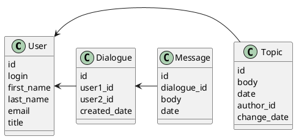

# Компонентная архитектура
<!-- Состав и взаимосвязи компонентов системы между собой и внешними системами с указанием протоколов, ключевые технологии, используемые для реализации компонентов.
Диаграмма контейнеров C4 и текстовое описание. 
-->
## Компонентная диаграмма

```plantuml
@startuml
!include https://raw.githubusercontent.com/plantuml-stdlib/C4-PlantUML/master/C4_Container.puml

AddElementTag("microService", $shape=EightSidedShape(), $bgColor="CornflowerBlue", $fontColor="white", $legendText="microservice")
AddElementTag("storage", $shape=RoundedBoxShape(), $bgColor="lightSkyBlue", $fontColor="white")

Person(admin, "Администратор")
Person(moderator, "Модератор")
Person(user, "Пользователь")

System_Ext(web_site, "Клиентский веб-сайт", "HTML, CSS, JavaScript, Django", "Веб-интерфейс")

System_Boundary(conference_site, "Сайт социальной сети") {
   'Container(web_site, "Клиентский веб-сайт", ")
   Container(client_service, "Сервис авторизации", "C++", "Сервис управления пользователями", $tags = "microService")    
   Container(post_service, "Сервис записей на стене", "C++", "Сервис управления записями на стене", $tags = "microService") 
   Container(message_service, "Сервис сообщений", "C++", "Сервис управления сообщениями", $tags = "microService")   
   ContainerDb(db, "База данных", "PostgreSQL", "Хранение данных о сообщениях, постах и пользователях", $tags = "storage")
}

Rel(admin, web_site, "Просмотр/добавление/ редактирование информации о пользователях и их записях на стене")
Rel(moderator, web_site, "Модерация пользователей и их записей на стене")
Rel(user, web_site, "Регистрация, просмотр/изменение записей на стене и получение/отправка сообщений")

Rel(web_site, client_service, "Работа с пользователями", "localhost/person")
Rel(client_service, db, "INSERT/SELECT/UPDATE", "SQL")

Rel(web_site, post_service, "Работа с постами", "localhost/topic")
Rel(post_service, db, "INSERT/SELECT/UPDATE", "SQL")

Rel(web_site, message_service, "Работа с сообщениями", "localhost/message")
Rel(message_service, db, "INSERT/SELECT/UPDATE", "SQL")

@enduml
```
## Список компонентов  

### Сервис авторизации
**API**:
-	Создание нового пользователя
      - входные параметры: логин, пароль, имя, фамилия, email, обращение (г-н/г-жа)
      - выходные параметры: отсутствуют
-	Поиск пользователя по логину
     - входные параметры:  логин
     - выходные параметры: имя, фамилия, email, обращение (г-н/г-жа)
-	Поиск пользователя по маске имени и фамилии
     - входные параметры: маска фамилии, маска имени
     - выходные параметры: логин, имя, фамилия, email, обращение (г-н/г-жа)

### Сервис сообщений
**API**:
- Создание диалога
  - Входные параметры: 1 логин, 2 логин, дата создания
  - Выходные параметры: идентификатор диалога
- Получение списка диалогов
  - Входные параметры: логин
  - Выходные параметры: массив с диалогами(идентификатор, второй логин)
- Получение списка сообщений диалога
  - Входные параметры: идентификатор диалога
  - Выходные параметры: массив с сообщениями диалога, где указаны текст сообщения, автор и дата создания
- Создание сообщения
  - Входные параметры: получатель, текст сообщения, автор и дата создания
  - Выходные параметры: отстутсвуют 

### Сервис постов
**API**:
- Создание поста
  - Входные параметры: автор, содержание поста, дата создания
  - Выходные параметры: идентификатор поста
- Получение списка постов пользователя
  - Входные параметры: пользователь
  - Выходные параметры: массив с постами (идентификатор, автор, содержание поста, дата создания)
- Получение поста
  - Входные параметры: идентификатор поста
  - Выходные парамтеры: автор, содержание поста, дата создания
- Изменение поста
  - Входные параметры: идентификатор поста, автор, содержание поста, дата создания
  - Выходные параметры: отсутствуют


### Модель данных
